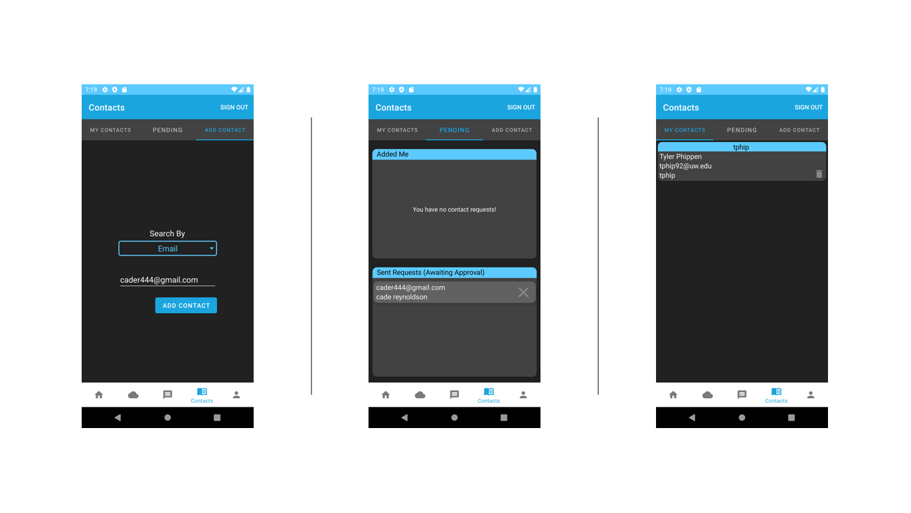
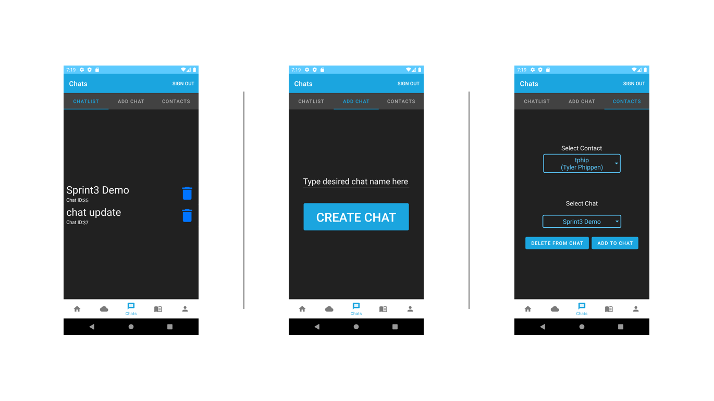
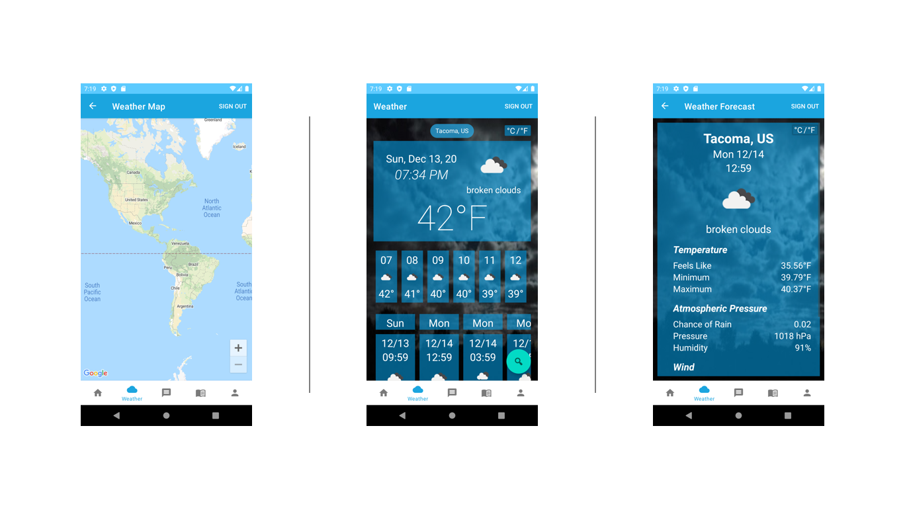
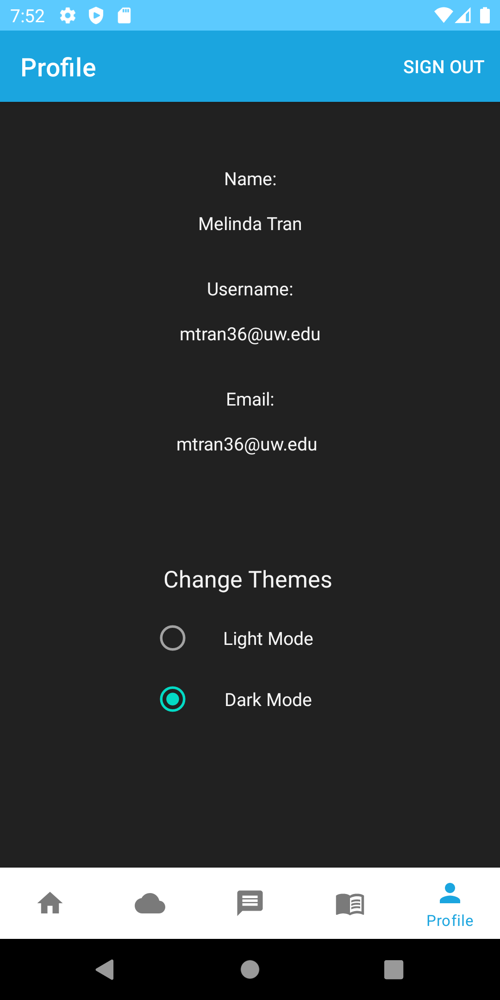

# 450 Project Group 3
Mobile application programming group project.

#### Requirements
- Android Studio 4.1
- Android SDK Platform-Tools 30.0.5
- Google Play Services 49
- JDK 8

#### Highlights
- Dark Mode
- Real time Adding Contacts
- Real time Chat
- Live Data Weather

#### Libraries and Dependencies
- com.google.android.geo.API_KEY
- com.google.android.gms:play-services-location:17.1.0
- com.google.android.gms:play-services-maps:17.0.0
- com.squareup.picasso:picasso:2.71828
- com.auth0.android:jwtdecode:2.0.0
- com.google.firebase:firebase-auth
- com.android.volley:volley:1.1.1
- me.pushy:sdk:1.0.54
- androidx.legacy:legacy-support-v4:1.0.0
- androidx.navigation.safeargs

# Developed By
Cade Reynoldson (cadereynoldson)

Patrick Lauer (bluedestiny88)

Tyler Phippen (TPhip92)

Melinda Tran (mtran36)

# Links
#### Google Drive Scrum Meetings
- https://drive.google.com/drive/folders/1kjMYcrst8tk-WVSqlbfr45HJRd6EOhab?usp=sharing

#### Group 3 Github Repo
- https://github.com/cadereynoldson/450GroupProject

#### Heroku Web Service
- https://dashboard.heroku.com/apps/cloud-chat-450

#### Web Server Repo
- https://github.com/cadereynoldson/450GroupProjectWebServer

#### Web Service Website
- https://cloud-chat-450.herokuapp.com/doc/

#### Support Contact
Email: tphip92@gmail.com

#### Guest Users Credentials:
Email: guest1@guest.com\
Username: guest1\
Password: Password1!

Email: guest2@guest.com\
Username: guest2\
Password: Password1!

# Implementations
#### Successful Implementations
###### Registration:
- All requirements were implemented
- Display verification process page upon successful registration

###### Login:
- All requirements were implemented
- Display home landing page upon successful login
- Can log out

###### Contact Page:
- Can view existing connections
- Search and add contacts by email or username
- Can view Contacts request (sent to you / sent by you)
- Can remove and decline sent request
- Can view a list of connections

###### Chat Page:
- Can create a chat and delete a chat
- Can add an existing contact to chat
- Can delete an existing contact from chat
- Send and recieve messages in chat
- Add contact to an existing chat

###### Notifications:
- All requirements were implemented
- Notifications will be displayed when in app and in status par when not in app

###### Weather Page:
- Can display weather forcast at device location
- Can choose a location by map
- Weather will display current, 24 horus, and 5 days forecast
- Background will change depending on weather descriptions
- Celcius and Farenheit is avaible for temperature

###### Home Landing:
- Group logo will be displayed

###### Additional:
- Profile page will contain name, username, and email
- Dark mode and light mode will be avaiable 
- Can automatically log back in when switch is on and user logged out

#### Incomplete Implementations
###### Contact Page: 
- No search on first or last name
- No sending invitations via email to use app

###### Chat Page:
- No notifications upon adding chat
- No image sending
- No seeing when another person is typing

###### Weather Page:
- Cannot search for location by zip code
- Cannot save a location for future use

###### Home Landing Page:
- Dynamic contents are not displayed

# API Keys Links
- Use [OpenWeatherMap] API to implement Weather Page
- Use [Google Maps] API to implement Map Page
- Use [Pushy] API to implement Chats messaging Page

[OpenWeatherMap]: https://openweathermap.org/
[Google Maps]: https://developers.google.com/maps/documentation/android-sdk/get-api-key
[Pushy]: https://pushy.me/
